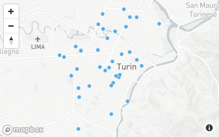

#### 3.1
95-100% (17% of rentals)

#### 3.2
95-100% (17% of rentals)

#### 3.3
21:00 (8%)

#### 3.4
20:00  (7%) and 21:00 (7%)

#### 3.5


#### 4.1
```
FILTER: {init_date: {$gt: Date('2017-09-30T06:00:00')}}
PROJECT: {plate:1, address:1}
```

#### 4.2
```
FILTER: {fuel: {$gt: 70}}
PROJECT: {fuel:1, address:1}
SORT: {fuel: -1}
```

#### 4.3
```
FILTER: {vendor: "car2go", exterior: "GOOD", interior: "GOOD"}
PROJECT: {plate:1, engineType: 1, fuel:1}
```

#### 4.4
```
FILTER: {'walking.distance': {$gt: 15000}}
PROJECT: {init_date: 1, init_fuel:1}
SORT: {fuel: -1}
```

#### 5.5
```
$group: {
  _id: "$final_fuel",
  avg_init_fuel: {
    $avg: "$init_fuel" 
  }
}
```

#### 5.6
```
$group: {
  _id: "$vendor",
  avg_driving_distance: {
    $avg: "$driving.distance" 
  }
}
```

car2go: 814.3315516849991\
enjoy: 1268.8942725389293\
Answer: enjoy


#### 6.7
```
{loc:{$geoWithin:{$centerSphere:[[7.683016, 
45.067764], 1/3959]}}}
```

#### 6.8
Polito coordinates in OpenStreetMap: `45.06466, 7.65773`

```
{
  loc: {
    $geoWithin: {
      $centerSphere: [
        [7.65773, 45.06466],
        1/3959
      ]
    }
  }
}
```